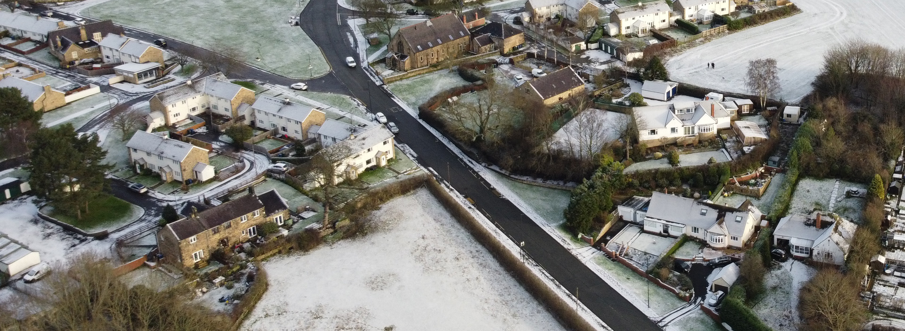
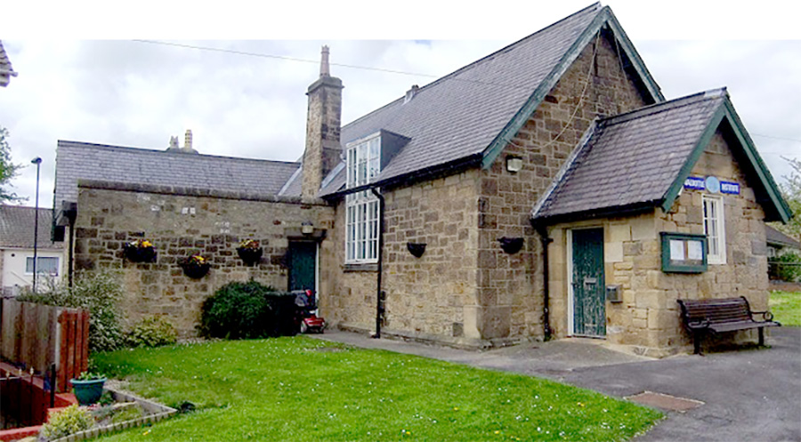

---
# Feel free to add content and custom Front Matter to this file.
# To modify the layout, see https://jekyllrb.com/docs/themes/#overriding-theme-defaults

layout: default
title: Home
---
	

	

		

	

		

		

			

			  <h2>Welcome</h2>
			  
<strong>The Walbottle Village Tenants and Residents Association was founded in 2020 during Covid lockdown to bring relief to residents of Walbottle Village by encouraging a community spirit and assisting the most vulnerable members of the community.</strong>

			  
The remit is expanding post lockdown to include a gardening club, a history group, a food bank collection and organising social events which are open to all. We pride ourselves in being fully inclusive, having minority groups on the committee.

			  <h5>Creating a more neighbourly village and a safe, beautiful place to live</h5>
			

			

		    <
			

		

		

		

	

		

		

			<h2>What's On</h2>
			<!-- feature slider -->
		

			
<button type="button" class="slideLeft" id="goToPrevSlide"></button>
			<ul id="lightSlider">

			
				<li class="featurePane col-xs-4">
					
					
					<h3>{{event.name}}</h3>
					
{{event.about}}

					<button class="more">Find out more </button>
					
				</li>
				

	        </ul>
				<button type="button" class="slideRight" id="goToNextSlide"></button>
			

		

	<!-- end art gallery light Slider -->
		

	

	

	

		

				<h2>Activity Groups</h2>
				
We have a wide variety of local groups in Walbottle, for more information please select a link below. If you would like more information or would like to start a group please contact us using one of the Get In Touch forms on the website.

				<ul>
					<li><a href="access_group.html" title="access Group" target="_self" class="ag-access" accessKey=""> Access Group</a></li>
					<li><a href="gardening_group.html" title="gardening group" target="_self" class="ag-garden" accessKey=""> Gardening Group</a></li>
					<li><a href="kids_corner.html" title="kids corner" target="_self" class="ag-kids" accessKey=""> Kids Corner</a></li>
					<li><a href="neighbourhood_watch.html" title="neighbourhood watch" target="_self" class="activity" accessKey=""> Neighbourhood Watch</a></li>
					<li><a href="photography_group" title="photography group" target="_self" class="ag-photo" accessKey=""> Photography Group</a></li>
					<li><a href="walbottle_choristers.html" title="Walbottle choristers group" target="_self" class="ag-choir" accessKey=""> Walbottle Choristers</a></li>
					<li><a href="walbottle_walks.html" title="Walbottle walks group" target="_self" class="ag-walks" accessKey=""> Walbottle Walks</a></li>
				</ul>
		

		

		

			<h2>Get in Touch</h2>
			
We would love to hear from our residents. Whether you would like to volunteer, suggest a Group, help create a neighbourly village or would like more information about anything you have read in our newsletter or website please contact us using the form below.

			
* donates required form fields.

			
			<form class="form-horizontal" id="form" action="https://clockwork-design.co.uk/clients/wvtra/formmail.php" method="post" name="Enquiry" data-toggle="validator" role="form">
				<input type="hidden" name="recipients" value="mailto:walbottlera@gmail.com,chris@clockwork-design.co.uk,peter@petersweb.me.uk" />
				<!-- this derives (creates) "email" and "realname" special fields from the input fields -->
				<input type="hidden" name="derive_fields" value="email=Email_Address,realname=Full_Name" />

				<!-- this excludes the "email" and "realname" special fields from the body of the email you receive -->
				<input type="hidden" name="mail_options" value="Exclude=email;realname" />
				<input type="hidden" name="subject" value="WVT&RA Website Enquiry" />
				<input type="hidden" name="good_url" value="#" />

				

					<label for="name" class="col-sm-2 control-label">Your name*</label>
					

						<input type="text" class="form-control" id="realname" name="Full_Name" placeholder="Your full name" data-error="Please enter your full name" required>
						

					

				

				

					<label for="location" class="col-sm-2 control-label">Your location</label>
					

						<input type="text" class="form-control" id="location" name="Location" placeholder="Your town or village (optional)" data-validate="false" >
					

				

				

					<label for="email" class="col-sm-2 control-label">Your email*</label>
					

						<input type="email" class="form-control" id="email" name="Email_Address" placeholder="Email" data-error="Please enter a correctly formatted email address" required>
						

					

				

				

					<label for="message" class="col-sm-2 control-label">Message*</label>
					

						<textarea class="form-control" id="message" name="Message" rows="4" placeholder="Your message" data-error="Please enter your message" required></textarea>
					

				

				

					

						<button type="submit" class="btn button block pull-right h-captcha">Send message</button>
					

				

			</form>
		

	

